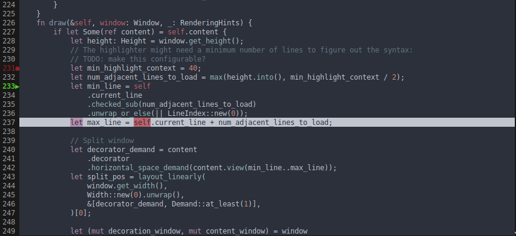

# unsegen_pager

[](https://crates.io/crates/unsegen_pager/)
[](https://docs.rs/unsegen_pager/)
[]()

`unsegen_pager` provides a pager widget for [unsegen](https://crates.io/crates/unsegen) including support for syntax highlighting (using [syntect](https://github.com/trishume/syntect)) and line decoration.

## Getting Started

`unsegen_pager` is [available on crates.io](https://crates.io/crates/unsegen_pager). You can install it by adding this line to your `Cargo.toml`:

```toml
unsegen_pager = "0.1.1"
```

## Screenshots



## Examples

There is an example at the root of the crate [documentation](https://docs.rs/unsegen_pager) which should be sufficient to get you going.

For a fully fledged application using `unsegen_pager`, you can have a look at [ugdb](https://github.com/ftilde/ugdb), which was developed alongside `unsegen` and the primary motivation for it.

## Licensing

`unsegen_pager` is released under the MIT license.
